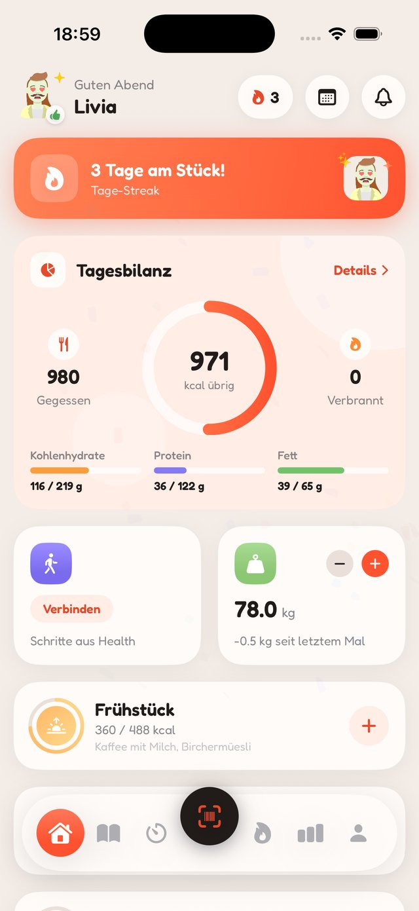
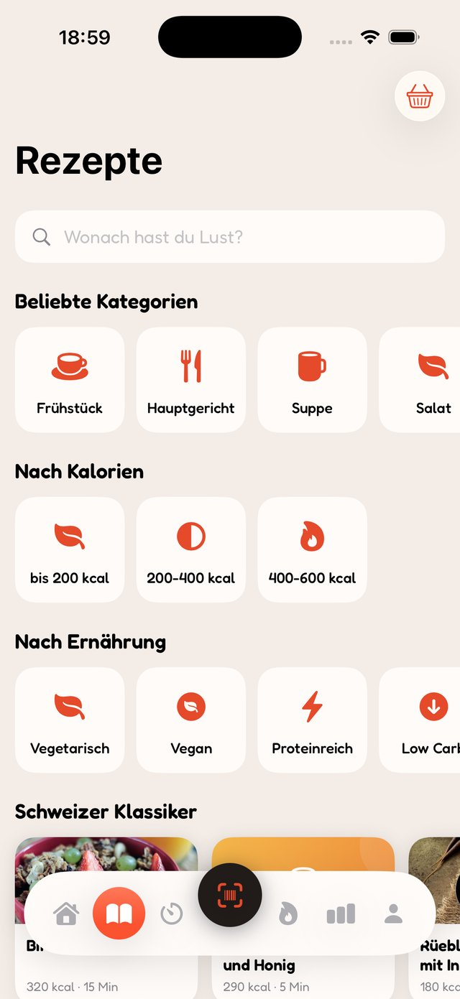
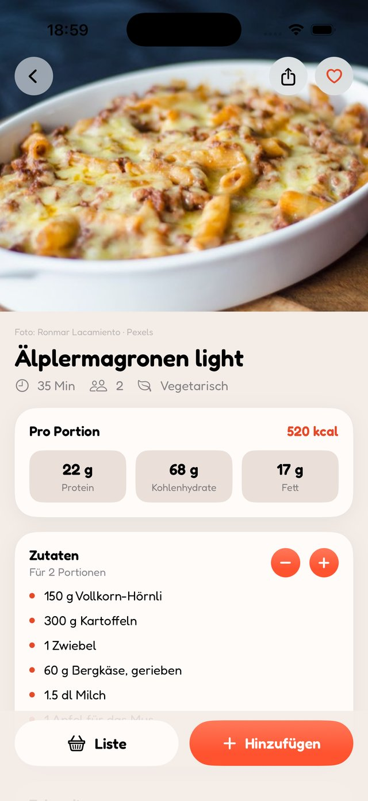
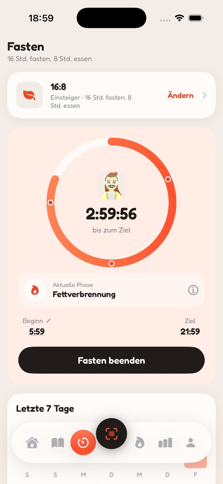
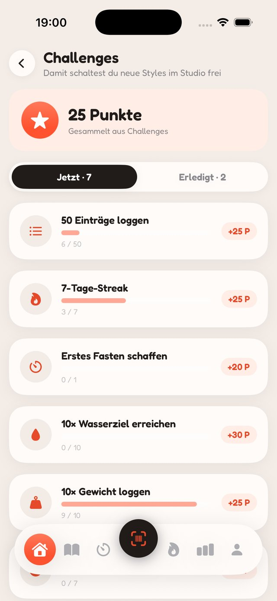
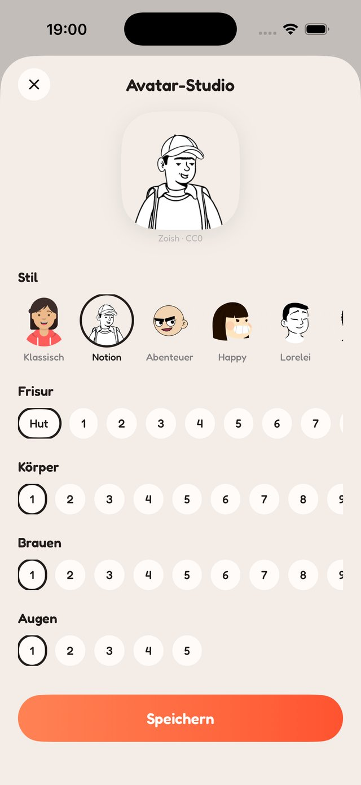
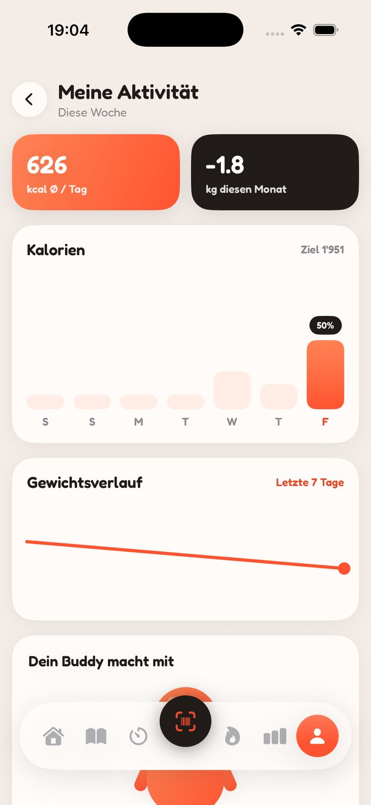
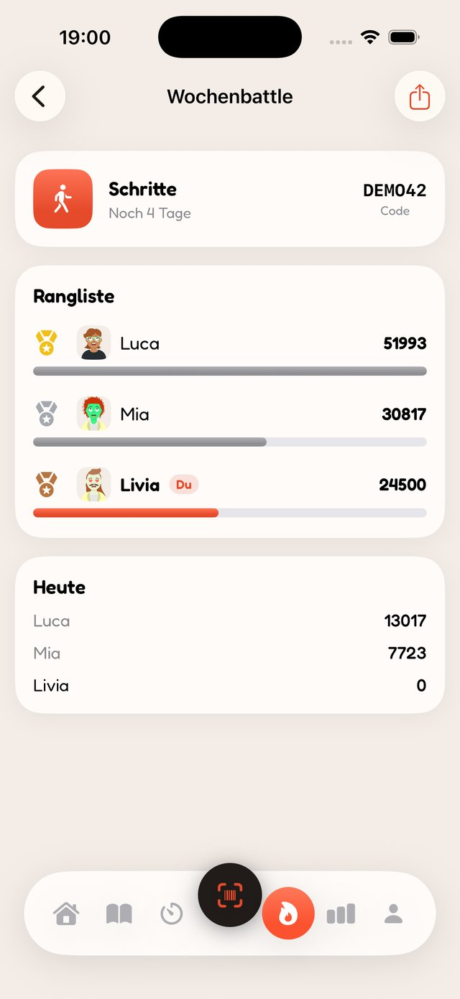
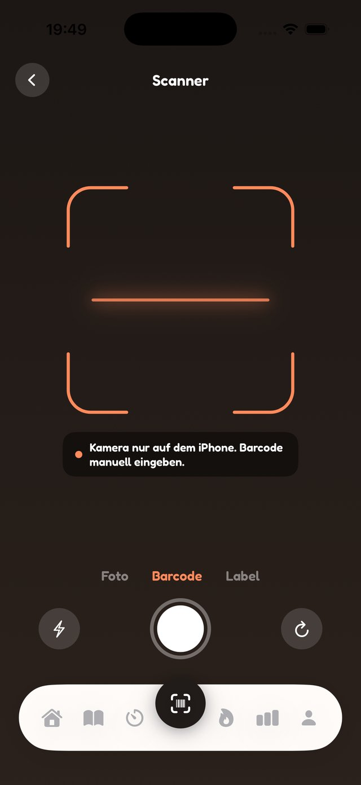

# Zwäg

**A fresh, playful calorie tracker for iOS. Swiss to the core.**


Zwäg (Swiss German for feeling fit and well) tracks your calories, macros, steps, water and weight. It is local first: all personal data stays on your device.

## Screenshots

| Diary | Recipes | Recipe |
|---|---|---|
|  |  |  |

| Fasting | Challenges | Buddy studio |
|---|---|---|
|  |  |  |

| Progress | Battles | Scanner |
|---|---|---|
|  |  |  |

## Features

- **Diary**: meals with calorie budgets and macros, water, weight, steps, mood, streaks and a reactive buddy mascot
- **Recipes**: 890 recipes across Swiss classics and 17 international cuisines, one tap logs a portion
- **Scanner**: live EAN scanning with Open Food Facts, offline cache, a label mode that reads nutrition tables with on device OCR, and the Swiss Food Composition Database (BLV, 1220 foods) bundled offline
- **Fasting**: 16:8, 14:10 and 12:12 with a Live Activity on the lock screen
- **Battles**: challenge friends over steps, active calories or calorie deficit with join codes (CloudKit ready, currently local demo opponents)
- **Calculators**: BMI, ideal weight, daily calorie needs (Mifflin-St Jeor) and calorie burn (MET based)
- **Apple**: HealthKit, home screen widget, Apple Watch app with complications, Siri Shortcuts
- **Personal**: 23 languages with RTL support, three looks, custom accent color

The full tour with details per screen: [FEATURES](docs/FEATURES.md)

## Getting started

Requirements: Xcode 26+, [XcodeGen](https://github.com/yonaskolb/XcodeGen)

```sh
brew install xcodegen
xcodegen generate
open Zwaeg.xcodeproj
```

The `.xcodeproj`, `Info.plist` and entitlements are generated from `project.yml` and not checked in. See [DEVELOPMENT](docs/DEVELOPMENT.md) for build commands, debug launch arguments and simulator tips.

## Documentation

- [Features](docs/FEATURES.md): the full tour, screen by screen
- [Architecture](docs/ARCHITECTURE.md): modules, data flow and design decisions
- [Development](docs/DEVELOPMENT.md): building, testing and debug tooling

## Credits

- Nutrition data: [Swiss Food Composition Database](https://naehrwertdaten.ch) (BLV) and [Open Food Facts](https://ch.openfoodfacts.org)
- Recipe photos: community contributed; every published photo is credited in [IMAGE-CREDITS](docs/IMAGE-CREDITS.md) and in the app on the recipe page
- Avatars: generated with [DiceBear](https://dicebear.com). Styles: Avataaars and Bottts by [Pablo Stanley](https://avataaars.com) (free for personal and commercial use), Notionists by Zoish (CC0), Adventurer and Lorelei by Lisa Wischofsky (CC BY 4.0 / CC0), Big Smile by Ashley Seo (CC BY 4.0), Open Peeps by Pablo Stanley (CC0), Personas by Draftbit (CC BY 4.0), Pixel Art and Thumbs by DiceBear (CC0), Fun Emoji by Davis Uche (CC BY 4.0), Micah by Micah Lanier (CC BY 4.0)
- Font: [Fredoka](https://fonts.google.com/specimen/Fredoka) (SIL Open Font License)

## License

[MIT](LICENSE)
